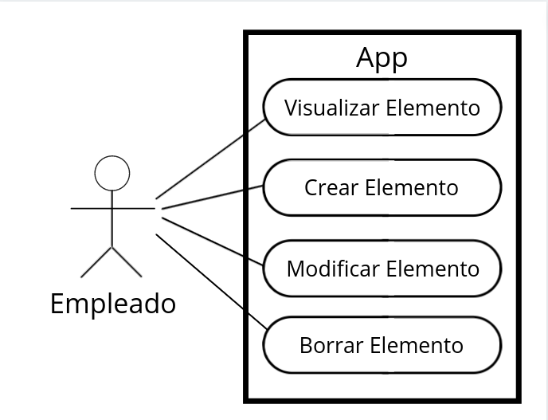
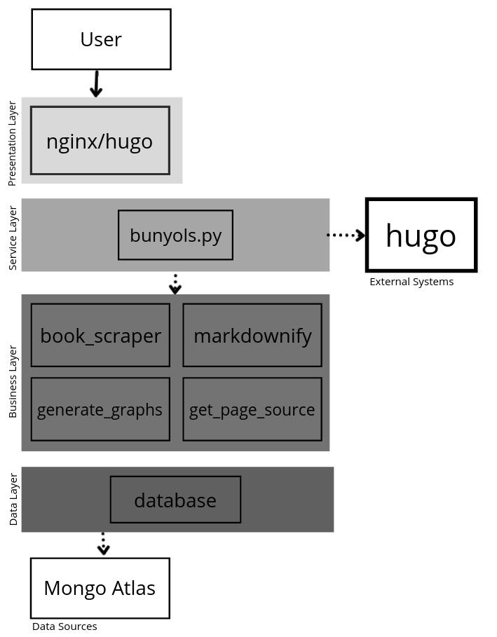
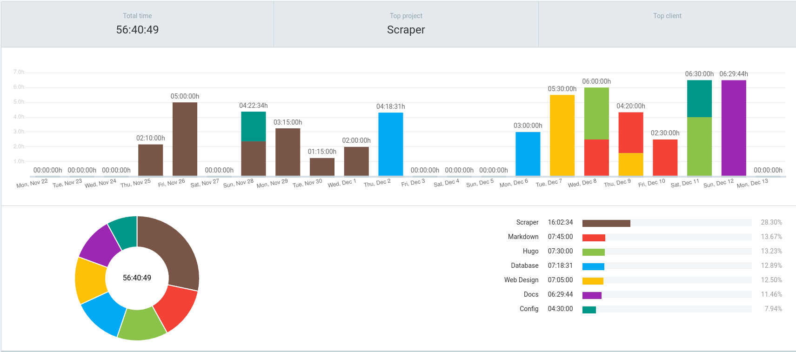

# The Bunyols Library

# Tabla de contenidos

- [The Bunyols Library](#the-bunyols-library)
- [Tabla de contenidos](#tabla-de-contenidos)
- [Introducción](#introducción)
- [Historia](#historia)
- [Manual](#manual)
  - [Pre-requisitos](#pre-requisitos)
  - [Instalación](#instalación)
  - [Uso](#uso)
- [Metodología](#metodología)
- [Descripción tecnica](#descripción-tecnica)
  - [Partes Interesadas y Requisitos Funcionales/No Funcionales](#partes-interesadas-y-requisitos-funcionalesno-funcionales)
  - [Diagrama de Casos de Uso](#diagrama-de-casos-de-uso)
  - [Arquitectura de la aplicacón](#arquitectura-de-la-aplicacón)
  - [Posibles Tecnologias](#posibles-tecnologias)
  - [Tecnologías y Herramientas Eligidas](#tecnologías-y-herramientas-eligidas)
- [Diseño](#diseño)
  - [Componentes](#componentes)
  - [Esquema BBDD](#esquema-bbdd)
  - [Ejemplo Real](#ejemplo-real)
- [Comparación Temporal](#comparación-temporal)
  - [Clockify](#clockify)
  - [Justificación temporal](#justificación-temporal)
- [Conclusiones](#conclusiones)
  - [Posibles mejoras](#posibles-mejoras)
- [Dificultades](#dificultades)


# Introducción

**Bunyols Library** nace con la idea de presentar la información básica que cualquier libro debe de tener. Únicamente información representativa sobre el libro en sí de una forma muy fácil para el usuario.

En este proyecto usaremos [*MongoDB*](https://www.mongodb.com) como base de datos a travez del servicio Mongo Atlas. 
Para la logica de la aplicacion usaremos el lenguage de programacion [*Python*](https://www.python.org) (version 3.9). 
Para la conversion y creacion de el sitio web estatico usaremos el SSG [*Hugo*](https://gohugo.io). 
Y por Ultimo, usaremos el servidor web [*Nginx*](https://www.nginx.com) para servir nuestro sitio web.


# Historia

Nuestro tan llamativo nombre surgió de un día ir caminando por Palma de Mallorca y una mujer en un puesto de estos aceitosos y sabrosas frutas fritas regalarme una bolsa de 1kg totalmente gratis. No era capaz de comerme tal semejante cantidad de [*fruta de sartén*](https://es.wikipedia.org/wiki/Bu%C3%B1uelo) y así fue como Samuele comió bunyols de camino al tren, dentro del tren y de desayuno al siguiente día. 

- *Con cariño, Eze*

# Manual

## Pre-requisitos
  - `Git` 
  - `Python3`
  - `pip3`
  - `fake-headers`
  - `bs4`
  - `lxml`
  - `pymongo`
  - `matplotlib` 

## Instalación

Se recomienda utilizar en `virtualenv` para instalar todas las dependencias utilizadas por el programa. En [Windows](https://docs.python.org/es/3.8/library/venv.html) lo puedes instalar siguiendo su guia. En **Linux** ejecuta la siguiente instrucción.

```
$ sudo apt-get install python3-venv
```

Crea un directorio y situate dentro de el. Aqui dentro residira todo el codigo de la aplicacion.

```
$ mkdir ./bunyols-library
$ cd bunyols-library
```

Ya dentro del directorio clona el repositorio.

```
$ git clone git@github.com:stonarini/Bunyols.git
```
Se preparo un archivo `setup` que activara el entorno virtual y descargara las dependencias necesarias por ti, ejecutalo.
```
$ ./setup.sh
```
Cuando se quiera entrar en el entorno virtual sin pasar por `./setup.sh`, ejecuta:
```
$ source venv/bin/activate
```
## Uso

**1. Formatea los elementos de la lista de la siguiente manera**.
```
("URL", ("Familia", ["Tematica"]))
```
- `URL` referencia a la pagina del libro en Amazon.
- `Familia` referencia al conjunto de libros que pertenece el actual.
- `Tematica` referencia al tema del libro.
  
**Un ejemplo**
```
("https://www.amazon.com/Clean-Code-Handbook-Software-Craftsmanship/dp/0132350882", ("Robert C Martin Series", ["IT"])
```
**2.Ejecuta `bunyols.py` encima del archivo donde esten todos tus libros a scrapear definiendo la carpeta de `Hugo` donde se creara el contenido**.

```
python3 bunyols.py [CARPETA]/
```
- `CARPETA` hace referencia al directorio de `Hugo`.

# Metodología

Para la parte lógica de la aplicación se ha usado una **metodología incremental** utilizando la filosofía de construir funcionalidades del programa, analizándolo y construyendo incrementos donde uno unido al otro tiene el fin de construir un uso funcional de la aplicación.

Para la parte de diseño web se ha usado una **metodología prototipada** donde hemos diseñado diferentes prototipos de la página en diferentes formatos *(papel y [software gráfico](https://www.figma.com/)).* Una vez elegido el diseño, se recreó en HTML y CSS pasándolo por último a **hugo**.

# Descripción tecnica

 ## Partes Interesadas y Requisitos Funcionales/No Funcionales
 Como parte interesada solo tenemos a lo que vienen siendo los empleados de la empresa que necesitan visualizar y gestionar los elementos de 
 la base de datos con nuestra aplicacion.  Podemos denominar esta parte interesada como *Empleado*.

 **Requisitos Funcionales**
 - RF_Epleado_01: Visualizar Elementos (R)

 - RF_Epleado_02: Crear Elementos (C)

 - RF_Epleado_03: Modificar Elementos (U)

 - RF_Epleado_04: Borrar Elementos (D)

 **Requisitos No Funcionales**
 - RnF_01: Recollecion Automatica de Datos
   - Al crear un nuevo elemento se usara un web scraper para recolecctar automaticamente datos sobre ese elemento.
 - RnF_02: Catalogacion de Elementos
   - A cada elemento se asignaran categorias que serviran para agruparlos
 - RnF_03: Creacion de Graficos
   - Se generaran automaticamente graficos al renderizar la pagina

 ## Diagrama de Casos de Uso

 
 ## Arquitectura de la aplicacón

 

- **Presentation layer**
  - **nginx/hugo** el primero es un software de servidor web open source utilizado para servir archivos HTML que construirá la segunda tecnología.

- **Service layer**
  - **bunyols.py** programa principal.

- **Business layer**
  - **get_page_source** encargado de hacer peticiones y general el contenido parseado de la página web solicitada.
  - **book_scraper** encargado de obtener los datos estáticos y dinámicos de la página web en la que se solicite la acción.
  - **markdownify** encargado de crear el *frontmatter* empleado por Hugo así de generar la estructura de los items devueltos al hacer peticiones a la base de datos.
  - **generate_graphs** encargado usando los datos dinámicos precios y reviews solicitados a la base de datos de realizar gráficos.

- **Data layer**
  - **database** todo lo relacionado a acciones hechas sobre y con la base de datos **MongoDB** con instrucciones de la librería 'pymongo.'

## Posibles Tecnologias

web-scraper | testing | generacion de graficos  
--- | --- | ---
[BS4](https://www.crummy.com/software/BeautifulSoup/) y [requests](https://docs.python-requests.org/en/master/index.html) | [pytest](https://docs.pytest.org/en/6.2.x/) | [ggplot](https://github.com/yhat/ggpy)  
[Selenium](https://www.selenium.dev/) | [Robot](https://robotframework.org/) | [matplotlib](https://matplotlib.org/)  

## Tecnologías y Herramientas Eligidas

- **[Python](https://docs.python.org/3/)**
  - **Beautiful Soup 4** es una biblioteca de Python para extraer datos de archivos HTML y XML dejando a elegir el parser para proporcional formas de navegación, búsqueda y modificación. [Referencia](https://www.crummy.com/software/BeautifulSoup/bs4/doc/)
  - **requests** es una librería HTTP para Python usada para efectuar peticiones HTTP y hacerlas más amigables.
  [Referencia](https://docs.python-requests.org/en/latest/)
  - **fake-headers** usada para generar una cabecera aleatoria para enmascarar diferentes peticiones y que no vengan bloqueadas.
  [Referencia](https://pypi.org/project/fake-headers/)
  - **matplotlib** es una librería para crear animaciones estáticas y visualizaciones interactivas en Python. [Referencia](https://matplotlib.org/stable/)
  - **pytest** es un framework usado para escribir casos test y poner aprueba aplicaciones y librerías. [Referencia](https://docs.pytest.org/en/6.2.x/)
  - **coverage** junto a *pytest* es una herramienta para medir el código cubierto de un programa. Monitoriza el programa informando de que cantidad de código ha sido ejecutada. [Referencia](https://coverage.readthedocs.io/en/6.2/)
- **[MongoDB](https://docs.mongodb.com/)**
  - **pymongo** es una librería que contiene herramientas para trabajar con [MongoDB](http://www.mongodb.org/). [Referencia](https://pymongo.readthedocs.io/en/stable/)
- **[Hugo](https://gohugo.io/documentation/)**
  - *Framework* empleado para la creación de sitios webs estáticos.
- **HTML5 y CSS**
  - Estilización de la parte web junto a hugo.
- **[Git](https://git-scm.com/docs)**
  - Realización de cambios y subida de versiones modificadas independientes, no sobrescribiendo en el archivo original.
- **Markdown**
  - Lenguaje de marcado ligero utilizado en **gohugo**

# Diseño


## Componentes

- **`utilities`** package que alberga *herramientas* que devuelven una información utilizada por otros módulos o realizan una tarea en específico.

- **`book_scraper`** package que alberga todo lo relacionado con el web scraper en sí, dentro de este existen 2 packages más 'get_book_dynamic_data' y 'get_book_static_data' que scrapean la información establecida dentro de sus módulos.

- **`get_page_source`** package que alberga aquellos métodos usados para ejecutar peticiones a una página y devolver el contenido que después será scrapeado por 'book_scraper'.

- **`markdownify`** package que alberga todo lo empleado para generar estructuras markdown así como lo necesario para 'Hugo'.

- **`generate_graphs`** package que alberga aquellos métodos empleados para generar gráficos mediante los datos 'precios' y 'reyes' contenidos en la base de datos.

- **`database`** package donde se sitúa todo lo relacionado con el manejo de la base de datos, en resumen, sus métodos CRUD.

## Esquema BBDD

```json
{
    "title": {
        "type": "string",
        "description": "Book's Title"
    },
    "author": {
        "type": "array",
        "description": "List of authors of the book"
    },
    "publisher": {
        "type": "string",
        "description": "Entity that published the book"
    },
    "ISBN_13": {
        "type": "string",
        "description": "Unique book's identifier"
    },
    "publish_date": {
        "type": "string",
        "description": "Day when the book was published"
    },
    "price": {
        "type": "array",
        "items": {
            "type": "object",
            "properties": {
                "value": {
                    "type": "string",
                    "description": "Current price of the book"
                },
                "date": {
                    "type": "string",
                    "description": "The date of when the price was retrived"
                }
            }
        },
        "description": "Array of object contaning the book price and the day the price was retrived"
    },
    "reviews": {
        "type": "object",
        "properties": {
            "total_reviews": {
                "type": "number",
                "description": "Total number of reviews of the book"
            },
            "5": {
                "type": "number",
                "description": "Total number of 5 star reviews"
            },
            "4": {
                "type": "number",
                "description": "Total number of 4 star reviews"
            },
            "3": {
                "type": "number",
                "description": "Total number of 3 star reviews"
            },
            "2": {
                "type": "number",
                "description": "Total number of 2 star reviews"
            },
            "1": {
                "type": "number",
                "description": "Total number of 1 star reviews"
            }
        }
    },
    "categories": {
        "type": "array",
        "items": {
            "type": "string",
            "description": "Category name"
        },
        "description": "Array of categories of the book"
    },
    "family": {
        "type": "string",
        "description": "Saga/Collection of which the book is part of"
    }
}
```
## Ejemplo Real
```json
{
    "title": "Code Complete",
    "author": [
        "Steve McConnell"
    ],
    "publisher": "Microsoft Press",
    "ISBN_13": "9780735619678",
    "publish_date": "June 2004",
    "price": [
        {"date": "2021-12-06 18:13:33", "value": "$16.43"},
        {"date": "2021-12-10 00:24:26", "value": "$29.99"},
    ],
    "reviews": {
        "total_reviews": 896, 
        "5": 699, 
        "4": 117, 
        "3": 45, 
        "2": 17, 
        "1": 18
    },
    "categories": ["IT"],
}
```

# Comparación Temporal

## Clockify
Para tener bajo control el tiempo utilizado y para poder comparar nuestras estimaciones hemos usado la herramienta Clockify con las siguientes etiquetas:

- **Scraper:** Para los módulos 'book_scraper' y 'get_page_source'.
- **Database:** Para el módulo 'database' y la creación del esquema y validación de la base de datos
- **Web Design:** Para el prototipado de la página web (tanto diseño como implementación HTML y CSS)
- **Hugo:** Para la configuración de 'Hugo' y para la implementación del prototipo realizado en 'Web Design'
- **Markdown:** Para los módulos 'markdownify' y 'generate_graphs'
- **Docs:** Para el tiempo usado para escribir esta documentación
- **Configuración:** Para configuración de git y para la configuración de herramientas y scripts (git-hooks, tox, pytest, etc...)
  


## Justificación temporal
Teniendo el gráfico presente la tarea en la que más hemos invertido tiempo ha sido en la creación de nuestro propio scraper, teníamos la opción de usar el scraper ya hecho por nuestros tutores de segundo, pero prescindimos de este al no ser posible adaptarlo del todo a los requisitos que queríamos.

Invertimos así el tiempo teniendo en mente que la lógica detrás de 'markdownify' no nos iba a ocupar el tiempo que sabíamos la creación del scraper desde cero sí.

# Conclusiones

## Posibles mejoras

- Estamos trabajando en la implementacion de [Typer](https://typer.tiangolo.com/) para poder realizar una inserción nueva de libros desde la linea de comandos.
- Estamos trabajando en la implementación de [Typer](https://typer.tiangolo.com/) para poder manejar funciones relacionadas al modulo de base de datos desde la linea de comandos.

# Dificultades

No hemos experimentado dificultades notorias mas haya que desarrollar el modulo `book-scraper` desde cero, pues el proyecto no consistia directamente en esta funcionalidad pero se necesitaba si queriamos crear el proyecto a nuestros gustos personales.

